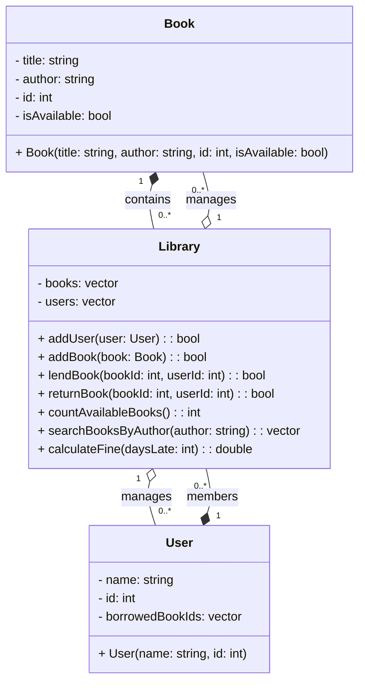

# Library Management System

This program manages book loans and returns for a small library.
It supports adding users and books, lending and returning books, counting available books, searching by author, and calculating overdue fines.

## UML Diagram



## Prerequisites

- Debian‑based Linux distribution
- `sudo` privileges
- g++ installed

## Installation

```bash
sudo apt update
sudo apt install -y build-essential
```

## File Structure

- **book.h**, **book.cpp**
  Defines the `Book` struct.

- **user.h**, **user.cpp**
  Defines the `User` struct.

- **library.h**, **library.cpp**
  Declares and implements `Library` class (core functionality).

- **main.cpp**
  Provides an interactive terminal menu to exercise all features.

- **README.md**
  This documentation.

## Compilation

```bash
g++ -std=c++17 -o library main.cpp book.cpp user.cpp library.cpp
```

## Running the Program

Launch the interactive menu:

```bash
./library
```

You will see options to:

1. Add User
2. Add Book
3. Lend Book
4. Return Book
5. Count Available Books
6. Search Books by Author
7. Calculate Late Fine
8. Exit

Follow on‑screen prompts to enter IDs, titles, author names, or days late.

## Example Session

```
Library Menu:
1. Add User
2. Add Book
3. Lend Book
4. Return Book
5. Count Available Books
6. Search Books by Author
7. Calculate Late Fine
0. Exit
Choose an option: 2
Enter book title: The Hobbit
Enter author: J.R.R. Tolkien
Enter book ID: 103
Book added.

Choose an option: 6
Enter author name: J.R.R. Tolkien
103: The Hobbit

Choose an option: 7
Days late: 5
Fine: $2.50

Choose an option: 0
Exiting...
```

### FlowChart

```mermaid
## Flowchart

```mermaid
flowchart TD
    subgraph LibraryManagement["Library Management System"]
        Start(("Start")):::start --> ShowMenu["Display Library Menu"]:::process
        ShowMenu --> InputChoice["Read User Choice"]:::input
        InputChoice --> DecisionChoice{Option Selected?}:::decision
        DecisionChoice -->|1| AddUser[Add New User]:::process
        DecisionChoice -->|2| AddBook[Add New Book]:::process
        DecisionChoice -->|3| LendBook[Lend Book to User]:::process
        DecisionChoice -->|4| ReturnBook[Return Book]:::process
        DecisionChoice -->|5| CountBooks[Count Available Books]:::process
        DecisionChoice -->|6| SearchAuthor["Search Books by Author"]:::process
        DecisionChoice -->|7| CalcFine[Calculate Late Fine]:::process
        DecisionChoice -->|0| Exit(("Exit")):::end
        DecisionChoice -->|else| Invalid["Invalid Option\nShow Error"]:::error

        %% loop back for all non‑exit actions
        AddUser --> ShowMenu
        AddBook --> ShowMenu
        LendBook --> ShowMenu
        ReturnBook --> ShowMenu
        CountBooks --> ShowMenu
        SearchAuthor --> ShowMenu
        CalcFine --> ShowMenu
        Invalid --> ShowMenu
    end

    classDef start   fill:#D5E8D4,stroke:#82B366,stroke-width:2px;
    classDef input   fill:#FFF2CC,stroke:#D6B656,stroke-width:2px;
    classDef process fill:#DAE8FC,stroke:#6C8EBF,stroke-width:2px;
    classDef decision fill:#F8CECC,stroke:#B85450,stroke-width:2px,stroke-dasharray:5 5;
    classDef error   fill:#FCE5CD,stroke:#E69138,stroke-width:2px;
    classDef end     fill:#E1D5E7,stroke:#9673A6,stroke-width:2px;
```