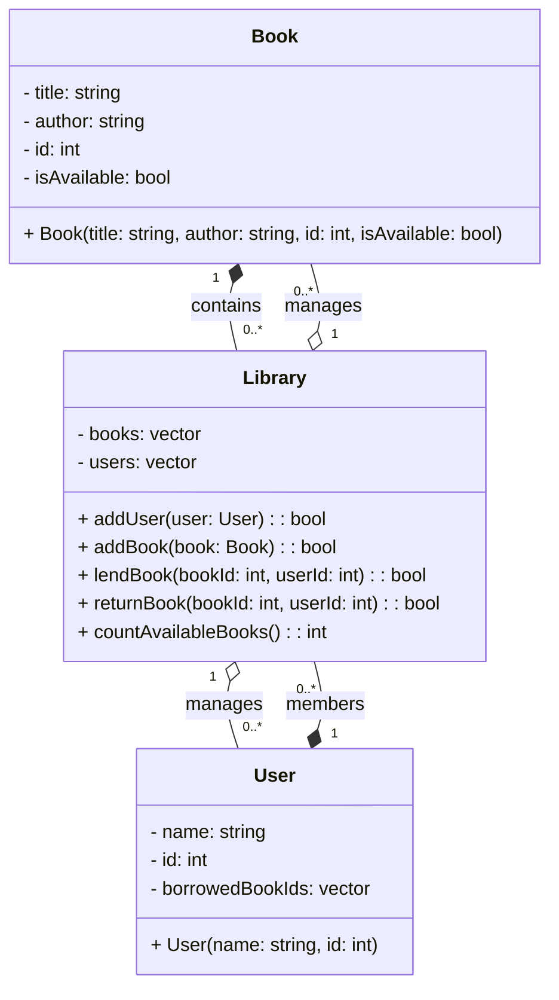

# Library Management System

This program manages book loans and returns for a small library.
It allows adding books, lending and returning them, and counting available books.

## UML Diagram



## Prerequisites

- Debian-based Linux distribution
- sudo privileges

## Installation

```bash
sudo apt update
sudo apt install -y build-essential
```

## File Structure

- book.h, book.cpp: Defines the Book structure.
- user.h, user.cpp: Defines the User structure.
- library.h, library.cpp: Declares and implements the Library class.
- main.cpp: Contains the main function demonstrating usage.
- README.md: Project documentation.

## Compilation

```bash
g++ -std=c++17 -o library main.cpp book.cpp user.cpp library.cpp
```

## Execution

```bash
./library
