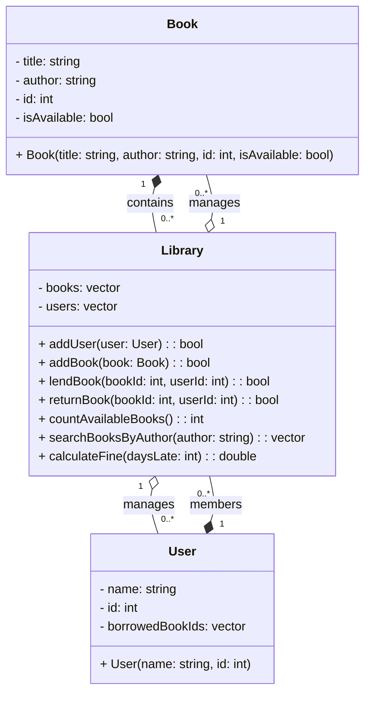

# Library Management System

This program manages book loans and returns for a small library.
It supports adding users and books, lending and returning books, counting available books, searching by author, and calculating overdue fines.

## UML Diagram



## Prerequisites

- Debian‑based Linux distribution
- `sudo` privileges
- g++ installed

## Installation

```bash
sudo apt update
sudo apt install -y build-essential
```

## File Structure

- **book.h**, **book.cpp**
  Defines the `Book` struct.

- **user.h**, **user.cpp**
  Defines the `User` struct.

- **library.h**, **library.cpp**
  Declares and implements `Library` class (core functionality).

- **main.cpp**
  Provides an interactive terminal menu to exercise all features.

- **README.md**
  This documentation.

## Compilation

```bash
g++ -std=c++17 -o library main.cpp book.cpp user.cpp library.cpp
```

## Running the Program

Launch the interactive menu:

```bash
./library
```

You will see options to:

1. Add User
2. Add Book
3. Lend Book
4. Return Book
5. Count Available Books
6. Search Books by Author
7. Calculate Late Fine
8. Exit

Follow on‑screen prompts to enter IDs, titles, author names, or days late.

## Example Session

```
Library Menu:
1. Add User
2. Add Book
3. Lend Book
4. Return Book
5. Count Available Books
6. Search Books by Author
7. Calculate Late Fine
0. Exit
Choose an option: 2
Enter book title: The Hobbit
Enter author: J.R.R. Tolkien
Enter book ID: 103
Book added.

Choose an option: 6
Enter author name: J.R.R. Tolkien
103: The Hobbit

Choose an option: 7
Days late: 5
Fine: $2.50

Choose an option: 0
Exiting...
```


### Flowchart

### Flowchart

```mermaid
flowchart TD
    subgraph Library["Library Management System"]
        Start(("Start")):::start --> Menu["Display Library Menu"]:::process
        Menu --> Choice{"Select Option"}:::decision
        Choice -->|1| AddUser[Add New User]:::process
        Choice -->|2| AddBook[Add New Book]:::process
        Choice -->|3| LendBook[Lend Book to User]:::process
        Choice -->|4| ReturnBook[Return Book]:::process
        Choice -->|5| CountBooks[Count Available Books]:::process
        Choice -->|6| SearchAuthor["Search Books by Author"]:::process
        Choice -->|7| CalcFine[Calculate Late Fine]:::process
        Choice -->|0| Exit(("Exit")):::endNode
        Choice -->|else| Invalid["Invalid Option\nShow Error"]:::error

        %% loop back
        AddUser --> Menu
        AddBook --> Menu
        LendBook --> Menu
        ReturnBook --> Menu
        CountBooks --> Menu
        SearchAuthor --> Menu
        CalcFine --> Menu
        Invalid --> Menu
    end

    classDef start    fill:#D5E8D4,stroke:#82B366,stroke-width:2px,color:#333333;
    classDef process  fill:#DAE8FC,stroke:#6C8EBF,stroke-width:2px,color:#333333;
    classDef decision fill:#F8CECC,stroke:#B85450,stroke-width:2px,stroke-dasharray:5 5,color:#333333;
    classDef error    fill:#FCE5CD,stroke:#E69138,stroke-width:2px,color:#333333;
    classDef endNode  fill:#E1D5E7,stroke:#9673A6,stroke-width:2px,color:#333333;

````