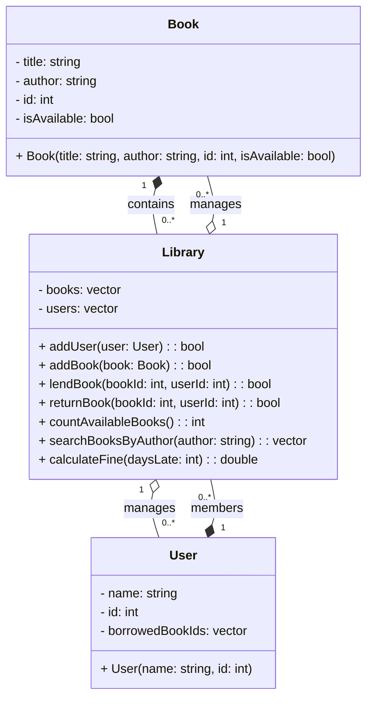

# Library Management System

This program manages book loans and returns for a small library.
It supports adding users and books, lending and returning books, counting available books, searching by author, and calculating overdue fines.

## UML Diagram



## Prerequisites

- Debian‑based Linux distribution
- `sudo` privileges
- g++ installed

## Installation

```bash
sudo apt update
sudo apt install -y build-essential
```

## File Structure

- **book.h**, **book.cpp**
  Defines the `Book` struct.

- **user.h**, **user.cpp**
  Defines the `User` struct.

- **library.h**, **library.cpp**
  Declares and implements `Library` class (core functionality).

- **main.cpp**
  Provides an interactive terminal menu to exercise all features.

- **README.md**
  This documentation.

## Compilation

```bash
g++ -std=c++17 -o library main.cpp book.cpp user.cpp library.cpp
```

## Running the Program

Launch the interactive menu:

```bash
./library
```

You will see options to:

1. Add User
2. Add Book
3. Lend Book
4. Return Book
5. Count Available Books
6. Search Books by Author
7. Calculate Late Fine
8. Exit

Follow on‑screen prompts to enter IDs, titles, author names, or days late.

## Example Session

```
Library Menu:
1. Add User
2. Add Book
3. Lend Book
4. Return Book
5. Count Available Books
6. Search Books by Author
7. Calculate Late Fine
0. Exit
Choose an option: 2
Enter book title: The Hobbit
Enter author: J.R.R. Tolkien
Enter book ID: 103
Book added.

Choose an option: 6
Enter author name: J.R.R. Tolkien
103: The Hobbit

Choose an option: 7
Days late: 5
Fine: $2.50

Choose an option: 0
Exiting...
```


```mermaid
flowchart TD
    A[Start Program] --> B[Initialize Library]
    B --> C{Show Menu \n and Get Choice}
    
    C -->|1. Add User| D[Input user name and ID]
    D --> E[Create User Object]
    E --> F[Add User to Library]
    F --> C

    C -->|2. Add Book| G[Input book title, author, and ID]
    G --> H[Create Book Object]
    H --> I[Add Book to Library (if not full)]
    I --> C

    C -->|3. Lend Book| J[Input book ID and user ID]
    J --> K[Check availability and user existence]
    K --> L[Lend Book if valid]
    L --> C

    C -->|4. Return Book| M[Input book ID and user ID]
    M --> N[Check if user has borrowed book]
    N --> O[Return Book and update availability]
    O --> C

    C -->|5. Count Available Books| P[Display number of available books]
    P --> C

    C -->|6. Search Books by Author| Q[Input author name]
    Q --> R[Find and Display Matching Books]
    R --> C

    C -->|7. Calculate Late Fine| S[Input number of late days]
    S --> T[Calculate and Display Fine]
    T --> C

    C -->|0. Exit| Z[End Program]

    C -->|Invalid Option| C
```